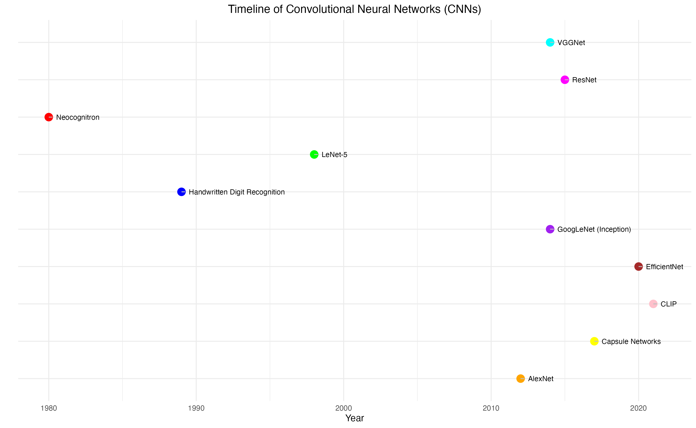

Contrastive Language-Image Pre-training (CLIP) is a Convolutional Neural Network (CNN) that learns visual concepts from natural language supervision and has been trained on a combination of images and their captions. CLIP bridges the gap between traditional CNN and natural language processing, providing several innovations and advancements such as generalization across tasks, increased flexibility, and scalability, and having an interface to natural language.

As part of **Deep Learning for Data Science (IDC 6146) at the University of West Florida**, our team critically analyzed, assessed, and reproduced the CLIP model and elaborated on potential applications in a professional report. This website was built using R/Quarto while the code for the analysis was built using Python/Jupyter, representing an interdisciplinary and collaborative approach to this group project.

This project was completed under the guidance of **Dr. Shusen Pu ([Shusen Pu \| Dr. Shusen Pu](https://www.shusenpu.com/)).**

Feel free to learn more on our website: 
